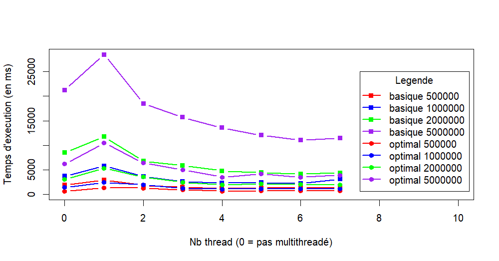

# AI26 TD8 - Crible d’Eratosthènes 

## Tâche 1
 
### Déroulement de l'algorithme pour n = 20
| i |  2  |  3  |  4  |  5  |  6  |  7  |  8  |  9  |  10 |  11 |  12 |  13 |  14 |  15 |  16 |  17 |  18 |  19 |  20 |
|----|-----|-----|-----|-----|-----|-----|-----|-----|-----|-----|-----|-----|-----|-----|-----|-----|-----|-----|-----|
| 2  |  V  |  ?  |  F  |  ?  |  F  |  ?  |  F  |  ?  |  F  |  ?  | F  |  ?  |  F  |  ?  |  F  |  ?  |  F  |  ?  |  F  |
| 
| 3  |  V  |  V  |  F  |  ?  |  F  |  ?  |  F  |  F  |  F  |  ?  | F  |  ?  |  F  |  F  |  F  |  ?  |  F  |  ?  |  F  |
| 
| 4  |  V  |  V  |  F  |  ?  |  F  |  ?  |  F  |  F  |  F  |  ?  | F  |  ?  |  F  |  F  |  F  |  ?  |  F  |  ?  |  F  |
| 
| 5  |  V  |  V  |  F  |  V  |  F  |  V  |  F  |  F  |  F  |  V  | F  |  V  |  F  |  F  |  F  |  V  |  F  |  V  |  F  |
| 

### Pourquoi la boucle de l’intérieure (la deuxième boucle) commence à $i^2$ et pas $0$ ou $i$ ?

Par souci d'optimisation. Lorsqu'on arrive à $i$, nous sommes forcément passés par $(i-n) i$ avec $\forall n \in [ 1, i-2 ]$ et nous n'avons pas besoin de recalculer cette valeur.

### Pourquoi la première boucle s’exécute jusqu’à √n? Que faites-vous si √n n’est pas un entier ? 

La deuxième boucle commence à $i^2$ et $sqrt(n)^2 = n$. Donc si la première boucle s'arrêtait plus loin que $sqrt(n)$, nous n'entrerions pas dans la deuxième boucle car $i^2 > n$.

## Tâche 2 

Voir code

## Tâche 3

Voir code

## Tâche 4 

Voir code

## Tâche 5 

Voici un graphe de nos résultats et le code R de l'analyse ensuite : 



 ```r
types_algos <- c("basique", "opti")
premiers_max <-  c(5*10^5, 10^6, 2*10^6, 4*10^6)
data <- data.frame(x = seq(0,7))

for (type in types_algos) {
  for (nmax in premiers_max) {
    syncro <- read.csv(sprintf("./data/%d/%s/syncro.csv",nmax,type))$data
    thread_1 <- read.csv(sprintf("./data/%d/%s/thread_1.csv",nmax,type))$data
    thread_2 <- read.csv(sprintf("./data/%d/%s/thread_2.csv",nmax,type))$data
    thread_3 <- read.csv(sprintf("./data/%d/%s/thread_3.csv",nmax,type))$data
    thread_4 <- read.csv(sprintf("./data/%d/%s/thread_4.csv",nmax,type))$data
    thread_5 <- read.csv(sprintf("./data/%d/%s/thread_5.csv",nmax,type))$data
    thread_6 <- read.csv(sprintf("./data/%d/%s/thread_6.csv",nmax,type))$data
    thread_7 <- read.csv(sprintf("./data/%d/%s/thread_7.csv",nmax,type))$data
    
    avg_threads <- c(mean(syncro), mean(thread_1), mean(thread_2), mean(thread_3),
                     mean(thread_4), mean(thread_5), mean(thread_6), mean(thread_7))
    
    data[sprintf("%s_%d", type, nmax)] <- avg_threads
  }
}

color=c("red", "blue", "green", "purple")


plot(data$x, data$basique_4000000, type="b", col=color[4], lwd=2, pch=15,
     xlab="Nb thread (0 = pas multithreadé)", ylab="Temps d'execution moyen (en ms)",
     ylim=range(0, max(data$basique_4000000)),
     xlim=c(0, 10))
k <- 3
for (type in types_algos) {
  for (i in seq(1, k)) {
    var <- sprintf("%s_%d", type, premiers_max[i])
    lines(data$x, data[[var]], 
          type="b", col=color[i], lwd=2, pch= if (type == "opti") 19 else 15)
  }
  k <- k + 1
}
legend(7.5, 25000,
       c(
         "basique 500000",
         "basique 1000000",
         "basique 2000000",
         "basique 5000000",
         "optimal 500000",
         "optimal 1000000",
         "optimal 2000000",
         "optimal 5000000"
       ), 
       col = c(color, color), 
       border = "black", 
       lwd = 2,         
       pch = c(15,15,15,15,19,19,19,19),              
       title = "Legende"    
)
 ```
